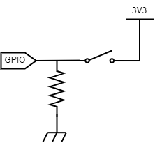
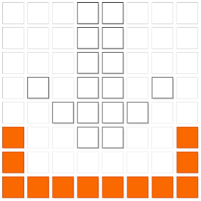

# Introduction

## Context
This project is a sound-based quality control tool designed for a roof tiles production line.
It takes the form of a box which:
- is connected to a microphone in order to record audio
- has a little LED screen for giving the user some feedback
- has two push buttons (a red one and a green one) which are the user input
 


It can record audio and events such as buttons presses (as well as detected hammer hits, which is specific to the context of the project).


## Table of Contents
<!-- TOC -->

- [Introduction](#introduction)
  - [Context](#context)
  - [Table of Contents](#table-of-contents)
- [How to setup this project](#how-to-setup-this-project)
  - [The hardware](#the-hardware)
    - [Components](#components)
    - [Wiring](#wiring)
  - [Software configuration](#software-configuration)
    - [Install Raspberry Pi OS Lite (64-bit)](#install-raspberry-pi-os-lite-64-bit)
    - [Set up remote access via SSH](#set-up-remote-access-via-ssh)
    - [Enable I2C](#enable-i2c)
    - [Install Git](#install-git)
    - [Get the project and the dependencies](#get-the-project-and-the-dependencies)
    - [Setup the auto-run script](#setup-the-auto-run-script)
- [How to use this project](#how-to-use-this-project)
  - [User feedback - LED screen](#user-feedback---led-screen)
    - [Normal use](#normal-use)
    - [Errors](#errors)
  - [User input - push buttons](#user-input---push-buttons)
  - [The output data](#the-output-data)
  - [Custom settings](#custom-settings)

<!-- /TOC -->


# How to setup this project

## The hardware

### Components

- a Raspberry Pi (I’m using a [Pi 4 model B](https://www.raspberrypi.com/products/raspberry-pi-4-model-b/))
    - a USB-C cable for power supply
    - a micro HDMI cable and a screen for configuration
- a [Raspberry Sense HAT](https://www.raspberrypi.com/products/sense-hat/)
- a microphone with a USB interface, here’s my setup:
    - I’m using the [MEK 600 Shotgun Microphone](https://www.sennheiser.com/en-us/catalog/products/microphones/mke-600/mke-600-505453) from Sennheiser
    - I’m also using a 18V AC phantom supply (the [MPS 500 Dual Phantom Supply](https://www.bax-shop.fr/alimentation-fantome/devine-mps-500-alimentation-fantome) from Devine)
    - 2 female male XLR cables (like [this one](https://www.bax-shop.fr/cables-xlr/devine-mic100-1-5-cable-micro-signal-xlr-1-5-metre))
    - a XLR to USB converter (I’m using the [MicCon interface XLR - USB](https://www.bax-shop.fr/carte-son-externe/devine-miccon-interface-xlr-usb) also from Devine)
- 2 push buttons
- a USB storage device (I’m using a classic USB stick)


### Wiring

Connect the buttons to the Pi:
- `GPIO 38` → green button
- `GPIO 40`→ red button

>I used 2-pin buttons with 1kΩ pull-down resistor, following this wiring diagram:
>
>


---


## Software configuration

### Install Raspberry Pi OS Lite (64-bit)

1. Format the SD card using the [Raspberry Pi Imager](https://www.raspberrypi.com/software/)
2. Downloading the OS image (you can find it [here](https://www.raspberrypi.com/software/operating-systems/))
3. Still on the Raspberry Pi Imager, while selecting OS, chose “Use custom” and select the image you just downloaded
4. Select “Change settings”. From there you can already configure WiFi and enable SSH (select “Use a password for authentication”). I also recommend to set a username and a password (keep these somewhere!).


### Set up remote access via SSH

> For this part you will need a screen connected to your Pi

1. Connect the screen and power the Pi
2. To find the IP address, run
    
    ```bash
    hostname -I
    
    # Other way to find the IP address:
    ip a 
    # search for “wlan0”, then next to “inet” you have the IP address
    ```
    
    **Note that address!**
    
    > If you didn’t configure WiFi with the Raspberry Pi Imager, you can still do it now :
    > 
    > 1. Run
    >     
    >     ```bash
    >     sudo raspi-config
    >     ```
    >     
    > 2. Go to “Interface Options”
    > 3. Go to “System Options”
    > 4. Go to “Wireless LAN”
    > 5. Follow the instructions
    > 6. Check if your WiFi network has been added correctly by running
    >     
    >     ```bash
    >     iwconfig
    >     ```
    >     
    >     You should see it among the list.
    >     
    
    > Same if you didn’t enable SSH with the Raspberry Pi Imager :
    > 
    > 1. Run
    >     
    >     ```bash
    >     sudo raspi-config
    >     ```
    >     
    > 2. Go to “Interface Options”
    > 3. Go to “SSH”
    > 4. Follow the instructions to enable SSH
3. Check if you can access your Pi via SSH
    
    Open a terminal and run
    
    ```bash
    ssh username@ip_address # replace with your info
    ```
    

If you have trouble while setting up the remote access, check [the official documentation](https://www.raspberrypi.com/documentation/computers/remote-access.html).

Once remote access is set up, you don’t need a screen for the Pi anymore, everything can be done remotely.


### Enable I2C

> I2C interface needs to be enable in order to communication with the [Sense HAT](https://www.raspberrypi.com/products/sense-hat/)
> 
1. Run
    
    ```bash
    sudo raspi-config
    ```
    
2. Go to “Interface Options”
3. Go to “I2C”
4. Follow th instruction to enable I2C


### Install Git

Start by

```bash
sudo apt update
sudo apt upgrade
```

Then run

```bash
sudo apt install git
```

Check if git is correctly installed

```bash
git --version
```

### Get the project and the dependencies

Install the development tools

```bash
sudo apt-get install python3-dev

# Check if it's installed
apt list --installed
```

Clone the git repository

```bash
git clone --recursive https://github.com/Damien-Bureau/roof-tiles-quality-control.git
```

Create a virtual environment and install the dependencies

```bash
# Go to the project folder
cd roof-tiles-quality-control

# Create a python venv named "venv"
python -m venv venv

# Activate the virtual environment
source venv/bin/activate

# Install the dependencies
pip install -r requirements.txt
```

The [RTIMU library](https://github.com/RPi-Distro/RTIMULib), which is a dependency of [Sense HAT](https://sense-hat.readthedocs.io/en/latest/), needs manual setup

```bash
cd venv
git clone --recursive https://github.com/RPi-Distro/RTIMULib.git

cd RTIMULib/Linux/python
python setup.py build
python setup.py install
```

Same for PortAudio, which is a dependency of [sounddevice](https://python-sounddevice.readthedocs.io/en/0.4.6/#), it needs manual operations

```bash
# Go to the portaudio folder
cd
cd roof-tiles-quality-control/portaudio

# Operations
./configure && make
sudo make install
sudo ldconfig

# Go back to the project main folder
cd ..

```
> Source for PortAudio setup [here](https://stackoverflow.com/questions/59006083/how-to-install-portaudio-on-pi-properly)


### Setup the auto-run script
Since the Pi is headless (no desktop environment), we have to make sure to launch the [main.py](main.py) script each time the Pi boots. I used [Linux systemd](https://systemd.io/) to handle that. <br>
Start by creating the script that will run [main.py](main.py)
```bash
sudo nano /etc/systemd/system/run_recording_script.service
```
Below a template for the content of the `.service` script. <br>
Replace each `USERNAME` by yours and adapt the paths if needed. 
```shell
[Unit]
Description=Run recording script

[Service]
ExecStart=sudo /home/USERNAME/roof-tiles-quality-control/venv/bin/python3 /home/USERNAME/roof-tiles-quality-control/main.py
WorkingDirectory=/home/USERNAME/roof-tiles-quality-control/
Restart=always
User=USERNAME

[Install]
WantedBy=multi-user.target
```

Save the file and reload the systemctl daemon
```bash
sudo systemctl daemon-reload
```

Enable the script and add execute permission
```bash
# Enable the script
sudo systemctl enable run_recording_script.service

# Go to script location
cd /etc/systemd/system/

# Check permissions before
ls -al run_recording_script.service # you should see "-rw-r--r--"

# Add execute permission
sudo chmod +x run_recording_script.service

# Check permissions after
ls -al run_recording_script.service # you should now see "-rwxr-xr-x"
```


---


# How to use this project

## User feedback - LED screen

The Sense HAT's 8x8 LED matrix is used to five the user feedback on what is going on.

### Normal use
There are two possible states.
1. **Not recording** <br>
    When the device is not recording, the following image is shown on the screen : <br>
     <br>
    A long press on the green button will switch the state to "recording".


2. **Recording** <br>
   
     <br>
    A long press on the red button will switch the state to "not recording". <br>
    
    When a push button is pressed, it will be saved in the csv events file with a timestamp. You will also see a feedback on the screen depending on the button you pressed: <br>
    
    

    The project includes the audio detection of hammer hits: each time a hit is detected, the following image will appear on the screen, meaning that the device is waiting for the user to label the hit by pressing one of the buttons. <br>
    


### Errors
The device is designed to be foolproof and handles several edge case. <br>
When a handled error occurs, an image representing the error will appear on the screen, flashing with a screen filled with red like this :


- No microphone <br>
     <br>
    This image on the screen means that no microphone is detected by the Python script. <br>
    The way the microphone is detected is by using the [pyudev](https://pyudev.readthedocs.io/en/latest/index.html) library, in  this function definded in [devices.py](./devices.py):
    ```python
    def is_microphone_connected():
        mic_name = "USB_PnP_Sound_Device" # to change if a different microphone is used
        mic_connected = False

        context = pyudev.Context()
        for device in context.list_devices():
            if mic_name in str(device.get('ID_MODEL')):
                mic_connected = True
        
        return mic_connected
    ```
    As you can see it depends directly on the name of the microphone used. <br>
    **If you want to use a different microphone, change the `mic_name` variable in the `is_microphone_connected()` function in [devices.py](/devices.py).**
    >Here's how you can find the name of the microphone you're using:
    >   ```python
    >    import pyudev
    >
    >    context = pyudev.Context()
    >    for device in context.list_devices():
    >            device_id = device.get('ID_MODEL')
    >            if device_id: # not None
    >                    print(device_id)
    >    ```


- No storage device available
  
     <br>
    With the [Raspberry Pi OS Lite](https://www.raspberrypi.com/software/operating-systems/#raspberry-pi-os-64-bit), the USB storage devices are not mounted automatically when plugged in, which means it's not possible to access the files. This is handled in [devices.py](./devices.py) by listening to udev events. <br>
    If your USB storage device is not detected (the error on the screen keeps showing), try to unplugging it then plugging it again.


- Error while writing on the storage device

     <br>
    If you see this image, it's probably because there is not enough space left on the storage device.


- Those are the main edge cases. However, if you feel like the device is not responding at all, try to reboot the Pi and it should be fine. <br>
    If you are working on the Pi and you don't want to reboot completely, you can use this command to restart only the Python script the same way it starts at boot:
    ```bash
    sudo systemctl restart run_recording_script.service
    ```

## User input - push buttons
The box includes two push buttons, which are the main user input.
There are two ways to use the buttons : normal press and long press.

>The duration of long press is 1.5 seconds by default, but it is possible to use a different value, see [Custom settings](#custom-settings).

See the [Normal use section](#normal-use) to understand how to use the buttons.


## The output data
Every record matches to an audio file and a csv file. They both have the name with the date and the time when the record started, for example `2024-03-19_14-33-52` `.csv` or `.wav`. <br>
The csv file contains the events that happened during the record, and the timestamps are based on the same time reference as the audio file. <br>
This is a visual representation of the output data you can get :

The red and green dots are the buttons presses, and the transparent dots are the detected hammer hits.

The audio files are always the same duration, which is by default 60 seconds. New files are automatically created when the record reaches this duration.
>It is possible to use a different audio file duration, see [Custom settings](#custom-settings).


## Custom settings
Some settings can be customized. They are stored in the `config.csv` file on the storage device.

- The sample rate for the audio recording
- The duration of the audio files (in seconds)
- The hammer hit detection is made using a low-pass filter and an amplitude threshold. <br>
  The cutoff frequency and the threshold can be changed.

Here's an example of the config file with the default values :
```
device_name;Microphone (Realtek High Definition Audio)
cutoff_Hz;1400
threshold;0.5
rec_duration_seconds;60
sample_rate_Hz;44100
waiting_duration_seconds;5
long_press_duration_seconds;1.5
min_time_gap_between_2_button_presses_seconds;0.1
min_time_gap_between_2_hits_seconds;0.5
```

The config file is read each time the storage device is plugged in. <br>
If an error occurs while reading the config file, a copy of the original file is created with the name `unreadable_config.csv`.

You can change the values manually (paying attention to syntax and formats).

I also created the script [setup_audio_device.py](./setup_audio_device.py) which allows you, through a [Tkinter](https://docs.python.org/3/library/tkinter.html) window, to adjust the cutoff frequency and the amplitude threshold, and see the results in real time. You can then confirm the configuration and select a location where to save the config file (on the storage device for example). <br>
This script is not finished and could be improved a lot, but it's not the main focus of the project. It's more like a useful tool if you have to compare configurations with different microphone.

>NB: the `device_name` property does not set the device used for recording on the Pi, which will always be *default*. This property is there for your information, so you know with which microphone you adjusted the parameters.